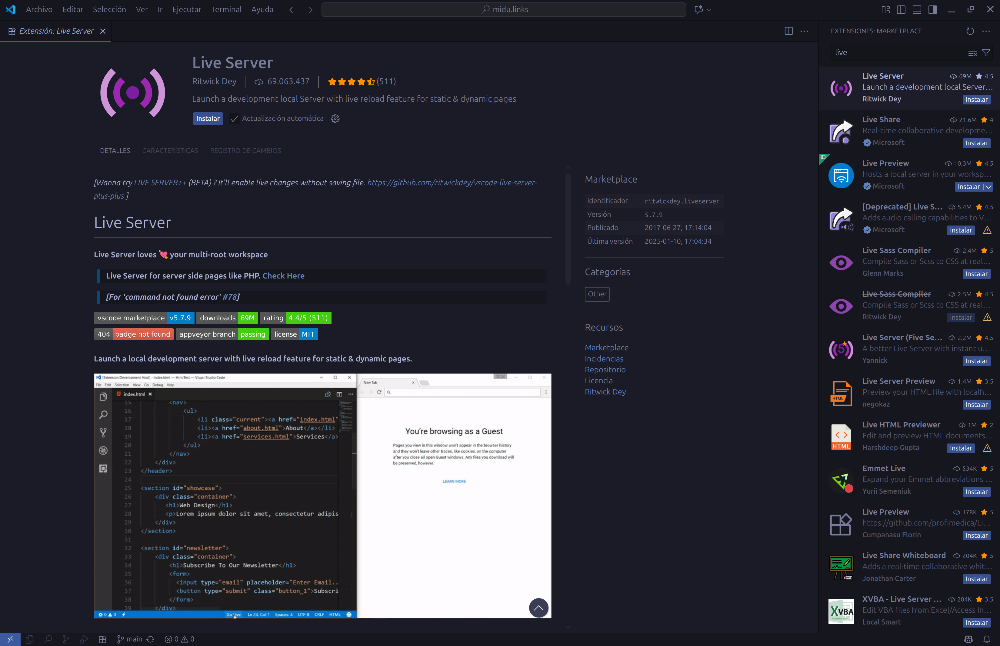
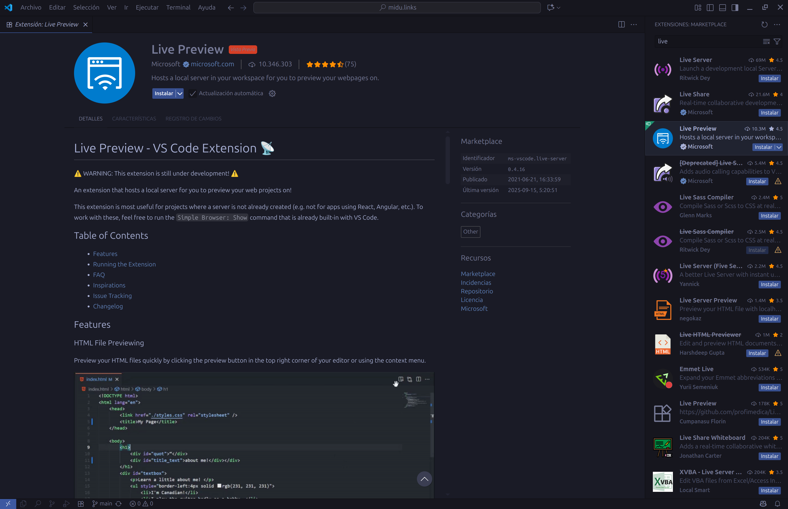

# Midu.links

Enlaces y cursos de [midudev](https://midudev.com) presentados con Tailwind CSS y animaciones personalizadas.

## Descripción

Este proyecto muestra enlaces a redes sociales y cursos de programación de midudev, usando estilos modernos con [Tailwind CSS](https://tailwindcss.com/) y el plugin [`@midudev/tailwind-animations`](https://www.npmjs.com/package/@midudev/tailwind-animations).

## Estructura

- [index.html](index.html): Página principal con enlaces y cursos.
- [input.css](input.css): Archivo fuente de estilos con Tailwind y plugins.
- [assets/](assets/): Imágenes, fuentes, SVG y CSS generado.
- [tailwind.config.js](tailwind.config.js): Configuración de Tailwind (si lo necesitas).
- [.vscode/settings.json](.vscode/settings.json): Configuración recomendada para VS Code.
- [package.json](package.json), [pnpm-lock.yaml](pnpm-lock.yaml): Dependencias y scripts.


## Instalación

1. Instala [pnpm](https://pnpm.io/) si no lo tienes.
2. Instala las dependencias:

   ```sh
   pnpm install
   ```

## Desarrollo

Para compilar los estilos y ver los cambios en tiempo real:

```sh
pnpm run build:styles
```

Esto genera el archivo [assets/output.css](assets/output.css) a partir de [input.css](input.css) usando Tailwind CSS y el plugin de animaciones.

## Uso

Abre [index.html](index.html) en tu navegador.

> **Importante:**  
> Si abres el archivo directamente (doble clic), los iconos SVG no se mostrarán correctamente por restricciones de rutas locales.  
> Para ver los iconos y todo el contenido correctamente, ejecuta el proyecto en VS Code usando **Live Server** o **Live Preview**.  
> Así se servirán los archivos desde un servidor local y los iconos cargarán sin problemas.

## Cómo instalar Live Server y Live Preview en VS Code

Para visualizar correctamente los iconos y rutas locales, se recomienda usar una extensión como **Live Server** o **Live Preview** en Visual Studio Code.

### Instalar Live Server

1. Abre la barra lateral de extensiones en VS Code (`Ctrl+Shift+X`).
2. Busca "Live Server" y haz clic en instalar.



### Instalar Live Preview

1. Abre la barra lateral de extensiones en VS Code (`Ctrl+Shift+X`).
2. Busca "Live Preview" y haz clic en instalar.



## Personalización

- Modifica [input.css](input.css) para cambiar estilos, colores o agregar utilidades.
- Puedes agregar más enlaces o cursos editando [index.html](index.html).
- Si necesitas configurar Tailwind, crea o edita [tailwind.config.js](tailwind.config.js).

## Dependencias principales

- [tailwindcss](https://tailwindcss.com/)
- [@tailwindcss/cli](https://www.npmjs.com/package/@tailwindcss/cli)
- [@midudev/tailwind-animations](https://www.npmjs.com/package/@midudev/tailwind-animations)

## Créditos

- [midudev](https://midudev.com) - Contenido y enlaces.
- Proyecto creado con Tailwind CSS y pnpm.

## Licencia

ISC
